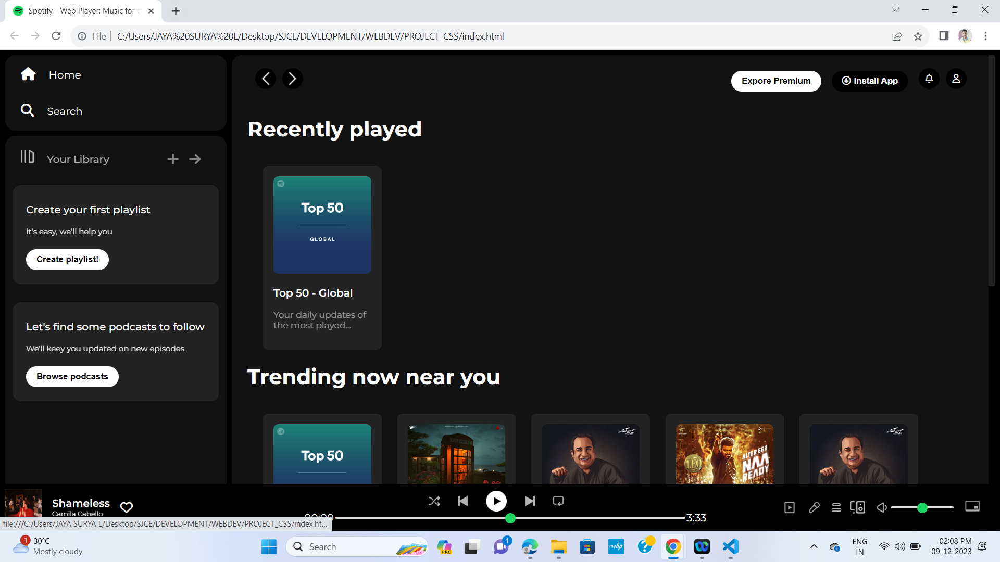
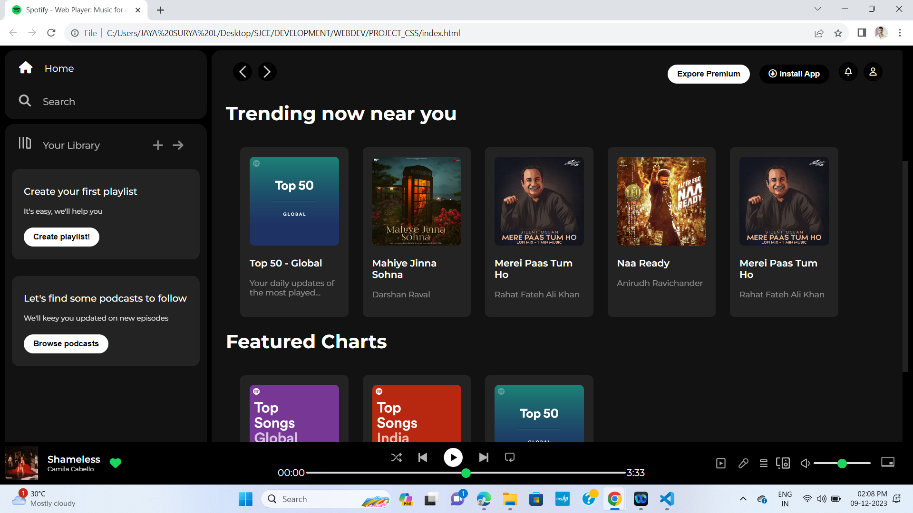
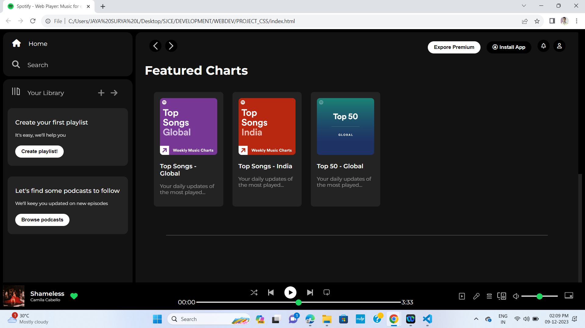

# SPOTIFY CLONE 

<h3>Description</h3>

A simple Spotify clone project created using HTML and CSS.

 

<h2>Demo</h2>

 

 

 
<h3>Installation</h3>
<ul>
<li>Clone the repository: git clone https://github.com/your-username/your-repository.git</li>
<li>Open the project folder: cd your-repository</li>
<li>Open the HTML file in your browser.</li>
</ul>
 
<h3>Usage</h3>

To use this Spotify Clone, simply open the index.html file in a web browser after cloning the repository to your local machine. Once loaded, you'll be greeted with a user interface resembling the Spotify web player. Navigate through the different sections using the sidebar, explore featured charts, and control music playback with the player controls. The clone offers a glimpse into Spotify's design and functionality, providing a familiar environment for users to enjoy and interact with. Customize playlists, explore trending songs, and experience a simplified version of the Spotify music streaming experience right in your web browser.

 
<h3>Contributing</h3>

If you'd like to contribute to this project, please follow these steps:

<ul>
<li>Fork the repository.</li>
<li>Create a new branch: git checkout -b feature/new-feature.</li>
<li>Make your changes and commit them: git commit -m 'Add new feature'.</li>
<li>Push to the branch: git push origin feature/new-feature.</li>
<li>Submit a pull request.</li>
